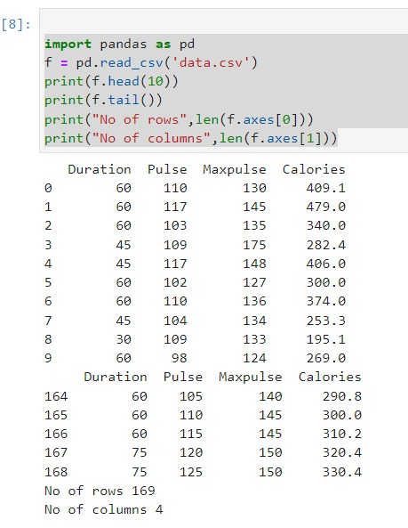

# Read-from-CSV

## AIM:

## ALGORITHM:
### Step 1:
Import pandas as pd.
### Step 2:
Read the CSV file using read_csv method.
### Step 3:
Use head and tail method to get the required contents from the file.
### Step 4:
Use len() method to get the number of rows and columns.

### Step 5:
Print the output.

## PROGRAM:
~~~
import pandas as pd
df=pd.read_csv('data.csv')
print(df.head(10))
print(df.tail())
print('No. of Columns:',len(df.axes[1]))
print('No. of Rows:',len(df.axes[0]))
~~~

## OUTPUT:

## RESULT:
Thus a python program is written to read the contents of a CSV file.

1. Find a positive real root of 𝒙
𝟑 − 𝒙 − 𝟐 = 𝟎 using Newton-Raphson method. 

def f(x):
 return x**3-x-2
def f1(x):
 return 3*x**2-1
xo=float (input ("Enter the initial approximation: "))
for i in range (1,10):
 xn=xo-f(xo)/f1(xo)
 xo=xn
print ("The approximate root using Newton-Raphson method is %.4f"%xn) 

2.Solve the system of equations 𝟒𝒙 + 𝒚 + 𝒛 = 𝟏; 𝒙 + 𝟑𝒚 + 𝒛 = 𝟐; 𝒙 + 𝒚 + 𝟓𝒛 = 𝟑, using
Gauss-Seidel method. 

x0=0; y0=0; z0=0
for i in range (1,10):
 x=1/4*(1-y0-z0)
 x0=x
 y=1/3*(2-x0-z0)
 y0=y
 z=1/5*(3-x0-y0)
 z0=z
print ("The approximate solution of x = %.4f, y= %.4f, z=%.4f"% (x, y,
z))

3.Using Lagrange interpolation formula, find the value corresponding to 𝒙 = 𝟏𝟎 from the
following table 

x= [0,1,2,4,5,6]
y= [1,14,15,5,6,19]
s=float (input ("Enter the value of x to be in: "))
sum=0
for i in range (0,6):
 prod=1
for j in range (0,6):
 if i!=j:
 prod=prod*(s-x[j])/(x[i]-x[j])
 sum=sum+prod*y[i]
print ("The functional value is %.4f"%sum) 

Program 4: Trapezoidal rule
Question:
Evaluate ∫
𝒅𝒙
𝟏ା𝒙
𝟐
𝟏
𝟎
 using trapezoidal rule with 𝒉 = 𝟎. 𝟐.
 
 def f(x):
 return 1/(1+x**2)
a=float (input ("Enter the lower limit: "))
b=float (input ("Enter the upperlimit: "))
h=float (input ("Enter the step size: "))
n=int((b-a)/h)
sum=0
for i in range (1, n):
 sum=sum+f(a+i*h)
trap=h/2*(f(a)+f(b)+2*sum)
print ("The Integral value is %.5f"%trap)

Program 5: Runge-Kutta method of fourth order
Question:
Find 𝒚(𝟎. 𝟐), given that 𝒅𝒚
𝒅𝒙
= 𝒙 + 𝒚
𝟐
, 𝒚(𝟎) = 𝟏 using Runge-Kutta fourth order method.

def f (x, y):
 return x+y**2
x0=float (input ("Enter initial point of x: "))
y0=float (input ("Enter initial point of y: "))
h=float (input ("Enter step value h: "))
k1=h*f (x0, y0)
k2=h*f (x0+h/2, y0+k1/2)
k3=h*f (x0+h/2, y0+k2/2)
k4=h*f (x0+h, y0+k3)
y=y0+(k1+2*k2+2*k3+k4)/6
print ("The value of y using RK method is %.4f"%y) 

Program 6: Adam’s predictor and corrector method 

def f (x, y):
 return x**2*(1+y)
x0=float (input ("Enter x0: "))
y0=float (input ("Enter y0: "))
x1=float (input ("Enter x1: "))
y1=float (input ("Enter y1: "))
x2=float (input ("Enter x2: "))
y2=float (input ("Enter y2: "))
x3=float (input ("Enter x3: "))
y3=float (input ("Enter y3: "))
h =0.1
y4p=y3+(h/24) *(55*f (x3, y3)-59*f (x2, y2) +37*f (x1, y1)-9*f (x0,
y0))
x4=x3+h
y4c=y3+(h/24) *(9*f (x4, y4p) +19*f (x3, y3)-5*f (x2, y2) +f (x1, y1))
print ("Approximate soln is %0.4f"%y4c) 
